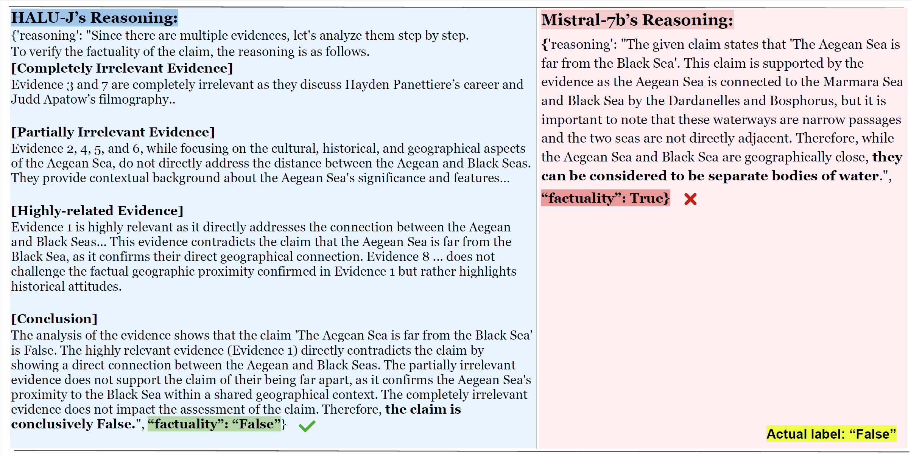

# Halu-J: Critique-Based Hallucination Judge

This folder contains the resources for [Halu-J](https://arxiv.org/abs/2407.12943).

## Table of contents
- [Introduction](#Introduction)
- [Evaluation](#Evaluation)
- [Data](#Data)
- [Citation](#Citation)

## Introduction
We introduce HALU-J, an open-source, critique-based hallucination detection model with 7 billion parameters capable of providing fine-grained critiques and filtering out unrelated information during hallucination detection. It is featured with:
* __Workflow__: We establish a novel multiple-evidence hallucination detection workflow featuring evidence categorization, evidence reordering, evidence-by-evidence analysis, and information aggregation to construct a multiple evidence hallucination detection dataset _ME-FEVER_.
* __Capability__: Our model can filter unrelated contexts and generate detailed and reliable critique with a carefully designed format in multiple evidence scenarios.
* __Flexibility__: Our model can flexibly toggle between multiple evidence scenarios and single evidence scenarios.

Here is an example comparing critique of our model and critique of Mistral-7b-instruct-v0.2.



## Evalution
Here is our label prediction accuracy results of different models on various benchmarks.

| Model                   | ME-FEVER | FEVER | ANLI | WANLI | HaluEval | KBQA |
|-------------------------|----------|-------|------|-------|----------|------|
| GPT-3.5-Turbo            | 0.81     | 0.87  | 0.47 | 0.47  | 0.59     | 0.69 |
| GPT-4o                   | 0.83 | **0.88** | <u>0.74</u> | <u>0.6</u> | <u>0.81</u> | <u>0.84</u> |
Mistral-7B-Instruct-v0.2 | 0.78     | 0.82  | 0.62 | 0.54  | 0.57     | 0.68 |
| llama-2-13b-chat-hf      | 0.13     | 0.37  | 0.27 | 0.29  | 0.24     | 0.19 |
| Llama-3-8B-Instruct      | 0.63     | 0.03  | 0.02 | 0.00  | 0.01     | 0.20 |
| Qwen1.5-7B-Chat          | 0.49     | 0.79  | 0.68 | 0.53  | 0.61     | 0.69 |
| Halu-j (w/o DPO) | **0.90** | 0.90 | 0.69 | 0.54  | 0.65     | 0.76 |
| Halu-j           | <u>0.91</u>   | <u>0.90</u>  | **0.70**  | **0.54**  | **0.65**  | **0.76** |

## Data
The training data and testing data is in `data` folder.
Each instance is a dictionary following the format below.
```python
{
    "claim": the original claim of FEVER data,
    "golden_evidence": the original evidence of FEVER data,
    "label": the original label of FEVER data,
    "completely_irrelevant_evidence_x": a synthetic completely irrelvant evidence,
    "partial_irrelevant_evidence_x": a synthetic partial irrelevant evidence,
    "misled_evidence_x": a synthetic misleading evidence,
    "explanation_x"：the explanation of the corresonding misleading evidence
}
```

## Citation
Please cite our paper if it is helpful to you.
```
@article{wang2024halu,
  title={Halu-J: Critique-Based Hallucination Judge},
  author={Wang, Binjie and Chern, Steffi and Chern, Ethan and Liu, Pengfei},
  journal={arXiv preprint arXiv:2407.12943},
  year={2024}
}
```